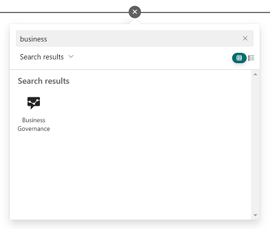
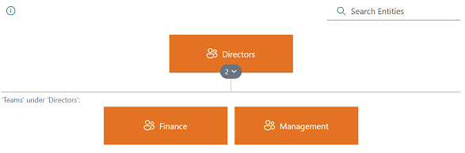

# Business Governance

Skip to
* [Installation](#installation)
* [Development](#development)

## Presentation
In an organization using Microsoft SharePoint, you occationally need a visually pleasing way, and end user centric way, of presenting, and interacting with, information which is inherently hierarchical in nature. This can for example be how legal entities in a company relates to business units, how corporate governance forums are structured to support decision-making, how projects and sub projects belong to programs, etc. etc.

As SharePoint has no built-in functionality for this, this solution was incrementally developed over several years to support Corporate Governance and Legal Structure requirements in [Vestas Wind Systems](https://www.vestas.com), and it is offered freely to any other organization using the [MIT/X Consortium License](https://github.com/vestas-digital-employee-tools/business-governance/blob/main/LICENSE).

The Project maintainers hopes that individuals and organizations will see fit to contribute back to the project through [raising issues](https://github.com/vestas-digital-employee-tools/business-governance/issues/new/choose) and [pull requests](https://github.com/vestas-digital-employee-tools/business-governance/compare), so that we can jointly improve the solution as time progresses.

> [!IMPORTANT]
> As a user of this solution ***you are always required to do your own due dilligence*** regarding if the solution, at any time, is fit for your purpose and to inspect the code base to ensure it meets your/your organizations requirements for Legal (i.e. GDPR), Information Security, supportability, general code quality and other requirements.

The solution is a SharePoint Framework (SPFx) solution which, through no-code configuration, features
* End user benefits
  * Display entities (list items) as a hierarchy
  * Collapse/expand groups of entities
  * Display entities as cards  * 
  * Modal display of individual entities
  * Responsive UI design adapting to display sizes
  * Use deep (external) linking to individual, or groups of, entities
  * Search for entities using fast fuzzy text search
  * Maintain people fields in entities using inline rich people picker control
  * Have outbound links automatically rendered as active links
* Administrator benefits
  * Plug'n'play using only native SharePoint Online site features
  * Automatically bootstrap entire solution on first run
  * No-hassle upgrades through strict adhrence to [Semantic Versioning](https://semver.org/)
  * Define data model using list Content Types
  * Use lookup fields to reference between lists
  * Use JSON to define visual representation of entities
  * Set specific colors for different types of entities
 
.png)

## Installation

1. Download the latest package `BusinessGovernance.Core.sppkg` from [releases](https://github.com/vestas-digital-employee-tools/business-governance/releases).

2. Add `BusinessGovernance.Core.sppkg` to the global tenant app catalog or a site collection app catalog. If you don't have an app catalog, follow this [procedure](https://docs.microsoft.com/en-us/sharepoint/use-app-catalog) to create one.

3. Add the Web Part to a page.

## Upgrading

The project uses [Semantic Versioning](https://semver.org/) to version the releases, to upgrade to the next compatible version, follow the steps:

1. Download the latest package `BusinessGovernance.Core.sppkg` from [releases](https://github.com/vestas-digital-employee-tools/business-governance/releases).

2. Overwrite the existing file in your app catalog.

## Getting Started

### Empty Site

When the Web Part is inserted into a page, it will try to make qualified guesses about what data to show. If the
site is empty, it will not be able to make a guess, instead it will show:

Clicking the button will setup the initial lists and data structure to the the solution running:

### Existing Site

When inserting the Web Part into an existing site with data, the Web Part will show data from an arbitrary list. To
configure what data to show, edit the page and update the properties in the Web Part:

(The Bootstrap-functionality is also available from the Advanced tab)

## Development

-   Install [Node.js](https://nodejs.org/) `v18`
-   Fork & clone the repository
-   `npm install`
-   `npm run dev`
-   Make changes

Guidelines:

-   Use [Tailwind](https://tailwindcss.com/) instead of Sass
-   Use React function components
